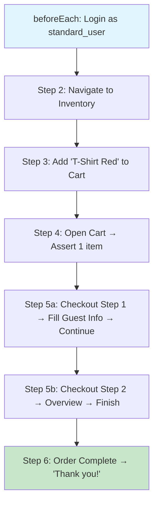

# KB: e2e-checkout.spec.ts — End-to-End Checkout Flow Explained

> **Knowledge Base Article** | Framework: AdvancePlaywrightFramework2x  
> File: `src/tests/e2e/e2e-checkout.spec.ts`

---

## 🗺️ The Big Picture

This test simulates a **complete purchase journey** on TTACart — from login all the way to the "Thank you for your order!" confirmation. It touches **5 different page objects** and uses the framework's key utilities.

```
Login ──► Inventory ──► Add Item ──► Cart ──► Checkout Step 1 ──► Checkout Step 2 ──► Complete!
                                                       (Fill guest info)      (Overview → Finish)
```

---

## Section 1: The JSDoc Comment (Lines 1–7)

```typescript
/**
 * End-to-end checkout flow:
 *   1. Log in as a standard user (standard_user / tta_secret).
 *   2. Navigate to the inventory page.
 *   3. Add the first item to the cart.
 *   4. Navigate to the cart page.
 *   5. From the cart, proceed through checkout step one and checkout step two.
 *   6. Enter the customer details and complete the order.
 */
```

| What it tells you (in plain English) |
|---|
| 1. Log in as `standard_user` |
| 2. Go to the inventory (product listing) page |
| 3. Add the first item to cart |
| 4. Go to the cart page |
| 5. Proceed through checkout step one → checkout step two |
| 6. Enter customer details and complete the order |

This is a **6-step journey** — the doc acts as a map so anyone reading the file instantly knows what's being tested.

---

## Section 2: Imports (Lines 9–14)

```typescript
import { test, expect } from '@fixtures/test-base';   // Our custom test (not Playwright's raw test)
import { DataGenerator } from '@utils/DataGenerator';   // Generates fake customer data
import { credentials } from '@config/credentials';       // Real login credentials (standard_user / tta_secret)
import { createLogger } from '@utils/logger';            // Winston-based structured logging
import { visualStep } from '@utils/visualStep';          // Like test.step(), but can also take screenshots
```

| Import | Source | Purpose |
|---|---|---|
| `test` | `@fixtures/test-base` | Custom test with all page-object fixtures pre-wired |
| `expect` | `@fixtures/test-base` | Re-exported Playwright expect — one import for everything |
| `DataGenerator` | `@utils/DataGenerator` | Generates random `firstName`, `lastName`, `postalCode` using Faker v8 |
| `credentials` | `@config/credentials` | Pulls `standardUser` and `password` from env vars (with defaults) |
| `createLogger` | `@utils/logger` | Creates a scoped Winston logger for this spec file |
| `visualStep` | `@utils/visualStep` | Wraps `test.step()` + optional screenshot attachment |

> 💡 Note: `{ test, expect }` comes from `@fixtures/test-base`, **NOT** from `@playwright/test`. This gives us access to all the custom fixtures defined in `test-base.ts` (like `loginPage`, `inventoryPage`, etc.).

---

## Section 3: Module-Level Setup (Lines 16, 19)

### Logger

```typescript
const log = createLogger('e2e-checkout');
```

Creates a logger **once** when the module loads (not per test). All logs from this file will be tagged `e2e-checkout` — makes debugging easy since you can trace which spec file produced each log line.

```
Example output:
2026-08-27 10:15:30 [e2e-checkout] info: Step 2: navigating to the inventory page
2026-08-27 10:15:32 [e2e-checkout] info: Step 3: adding item "test-allthethings-tshirt-red" to the cart
```

### Item Constant

```typescript
const FIRST_ITEM_ID = 'test-allthethings-tshirt-red';
```

A named constant for the item we'll add to the cart. Using a named constant (instead of a magic string buried in the test) makes the test:
- **Self-documenting** — the name tells you what it represents
- **Easy to change** — one edit updates every reference
- **Safe from typos** — the compiler catches misspellings of `FIRST_ITEM_ID`

---

## Section 4: `test.describe` — The Test Suite (Line 21)

```typescript
test.describe('@P0 @Regression E2E @Checkout Checkout Feature', () => {
```

This groups the test(s) and has **tags embedded in the title**:

| Tag | Meaning |
|---|---|
| `@P0` | **Highest priority** — critical path, must pass |
| `@Regression` | Part of the regression suite |
| `E2E` | End-to-end test (spans multiple pages) |
| `@Checkout` | Feature tag for filtering in reports |
| `Checkout Feature` | Human-readable description |

> 💡 These tags are used by the HTML reporter to filter and categorize tests. You can run just `@P0` tests with: `npx playwright test --grep "@P0"`

---

## Section 5: `beforeEach` — Setup (Lines 23–28)

```typescript
test.beforeEach(async ({ loginPage }) => {
    log.info(`Step 1: logging in as ${credentials.standardUser}`);
    await loginPage.open();
    await loginPage.loginAs(credentials.standardUser, credentials.password);
});
```

| Line | What happens |
|---|---|
| `{ loginPage }` | Destructures the `loginPage` fixture from `test-base` — already constructed with the test's `page` |
| `log.info(...)` | Logs the login attempt with the username (e.g., "Step 1: logging in as standard_user") |
| `loginPage.open()` | Navigates to `https://<baseURL>/playwright/ttacart/index.html` and waits for `domcontentloaded` |
| `loginPage.loginAs(...)` | Fills username input → fills password input → clicks Login button → waits for navigation OR error |

> 🎯 **Key insight**: This `beforeEach` runs **before every test in this describe block**. If we add more checkout tests later (e.g., "checkout with multiple items", "checkout with empty cart"), they all get logged in automatically. No code duplication!

---

## Section 6: The Test Itself (Lines 30–77)

### Test Signature & Customer Data (Lines 30–36)

```typescript
test('should complete checkout successfully', async ({
    page,
    inventoryPage,
    cartPage,
    checkoutStepOnePage,
    checkoutStepTwoPage,
    checkoutCompletePage,
}) => {
    const customer = DataGenerator.checkoutCustomer();
```

**What's happening:**

1. The test destructures **6 fixtures** at once — all injected automatically by `test-base`:
   - `page` — the raw Playwright page (browser tab)
   - `inventoryPage` — products listing page
   - `cartPage` — shopping cart page
   - `checkoutStepOnePage` — guest info form
   - `checkoutStepTwoPage` — order overview
   - `checkoutCompletePage` — confirmation page

2. `DataGenerator.checkoutCustomer()` generates **fresh random data every run**:
   ```json
   { "firstName": "Javier", "lastName": "Muller", "postalCode": "48144" }
   ```
   This means no two test runs use the same customer — **no test data collisions!**

---

### Step 2 (Lines 40–43) — Navigate to Inventory

```typescript
await visualStep(page, 'Go to the inventory page', async () => {
    log.info('Step 2: navigating to the inventory page');
    await inventoryPage.open();
});
```

| Element | Purpose |
|---|---|
| `visualStep(...)` | Wraps the action in `test.step()` so it appears as a named step in reports |
| `'Go to the inventory page'` | Human-readable step name (appears in HTML report, trace viewer) |
| `inventoryPage.open()` | Navigates to `/inventory.html` + asserts "Products" title is visible + at least 4 items loaded |

> 📸 If `ATTACH_SCREENSHOTS=true` is set as an env var, `visualStep` also captures a screenshot after this step and attaches it to the report. This is **opt-in** (not on by default) to keep test runs fast.

---

### Step 3 (Lines 46–49) — Add Item to Cart

```typescript
await visualStep(page, 'Add one item to the cart', async () => {
    log.info(`Step 3: adding item "${FIRST_ITEM_ID}" to the cart`);
    await inventoryPage.addToCart(FIRST_ITEM_ID);
});
```

| Method | What it does internally |
|---|---|
| `addToCart('test-allthethings-tshirt-red')` | Finds `[data-test="add-to-cart-test-allthethings-tshirt-red"]` and clicks it via `this.el.click()` |

The button text changes from "Add to cart" → "Remove" after clicking, but the test doesn't verify that here — it trusts that the cart count will validate it later.

---

### Step 4 (Lines 52–56) — Open Cart & Verify

```typescript
await visualStep(page, 'Open the cart', async () => {
    log.info('Step 4: opening the cart and verifying one row');
    await cartPage.open();
    expect(await cartPage.rowCount()).toBe(1);
});
```

| Line | What happens |
|---|---|
| `cartPage.open()` | Navigates to `/cart.html` + asserts "Your Cart" title is visible |
| `cartPage.rowCount()` | Counts all `[data-test="inventory-item"]` elements in the cart DOM |
| `expect(...).toBe(1)` | **The first explicit assertion** — verifies exactly 1 item is in the cart |

> � This is our first assertion in the test! Until now we've been setting up state — here we confirm the "Add to Cart" actually worked.

---

### Step 5a (Lines 58–63) — Checkout Step One (Fill Guest Info)

```typescript
await visualStep(page, 'Fill guest details (checkout step one)', async () => {
    log.info(`Step 5a: filling guest details for ${customer.firstName} ${customer.lastName}`);
    await cartPage.checkout();
    await checkoutStepOnePage.assertLoaded();
    await checkoutStepOnePage.fillGuest(customer);
    await checkoutStepOnePage.continue();
});
```

This is a **4-action sequence** packed into one visual step:

| # | Page Object Method | What It Does |
|---|---|---|
| 1️⃣ | `cartPage.checkout()` | Clicks `[data-test="checkout"]`, waits for page load |
| 2️⃣ | `checkoutStepOnePage.assertLoaded()` | Asserts title contains "Checkout" + firstName field is visible |
| 3️⃣ | `checkoutStepOnePage.fillGuest(customer)` | Fills 3 fields using the `DataGenerator` values: firstName, lastName, postalCode |
| 4️⃣ | `checkoutStepOnePage.continue()` | Clicks `[data-test="continue"]`, navigates to step-two |

> 💡 Notice `continue()` **doesn't assert** navigation succeeded — it deliberately leaves that to the next step's `assertLoaded()`. This keeps page objects "dumb" and lets the test control assertion flow.

---

### Step 5b (Lines 65–68) — Checkout Step Two (Overview → Finish)

```typescript
await visualStep(page, 'Finish the order (checkout step two)', async () => {
    log.info('Step 5b: reviewing the overview and finishing the order');
    await checkoutStepTwoPage.assertLoaded();
    await checkoutStepTwoPage.finish();
});
```

| Method | What It Checks |
|---|---|
| `assertLoaded()` | Title contains "Overview" AND subtotal label is visible |
| `finish()` | Clicks `[data-test="finish"]`, waits for navigation to complete page |

Checkout Step Two displays the order summary (subtotal, tax, total), but this test **skips** verifying those dollar amounts — it focuses on the flow, not the math. (There are separate tests for price calculations.)

---

### Step 6 (Lines 71–74) — Order Complete!

```typescript
await visualStep(page, 'Order is complete', async () => {
    log.info('Step 6: asserting the order is complete');
    await checkoutCompletePage.assertOrderComplete();
});
```

This calls `assertOrderComplete()`, which does **two things**:
1. Asserts the URL ends with `/checkout-complete`
2. Asserts the header says **"Thank you for your order!"**

> � This is the final assertion — the entire checkout flow is validated.

---

## 🔗 Visual Flow of the Test



---

## 🧩 How Everything Connects

```
┌──────────────────────────────────────────────────────────────────┐
│  e2e-checkout.spec.ts                                            │
│                                                                  │
│  Imported from test-base.ts:        External utilities:          │
│  ┌──────────────────────┐           ┌─────────────────────┐      │
│  │ test (custom)        │           │ DataGenerator        │      │
│  │ expect               │           │ credentials          │      │
│  │ loginPage fixture    │           │ createLogger         │      │
│  │ inventoryPage        │           │ visualStep           │      │
│  │ cartPage             │           └─────────────────────┘      │
│  │ checkoutStepOnePage  │                                        │
│  │ checkoutStepTwoPage  │                                        │
│  │ checkoutCompletePage │                                        │
│  └──────────────────────┘                                        │
└──────────────────────────────────────────────────────────────────┘
```

---

## 🧪 What `visualStep` Actually Does

`visualStep` is defined in `src/utils/visualStep.ts` and wraps `test.step()` with optional screenshot:

```typescript
export async function visualStep(
    page: Page,
    title: string,
    body: () => Promise<void>,
): Promise<void> {
    await test.step(title, async () => {
        await body();                          // Run the step's actual code

        const info = test.info();
        const index = stepCounters.get(info) ?? 0;
        stepCounters.set(info, index + 1);

        if (ATTACH_SCREENSHOTS) {              // Only if env var is set
            await info.attach(`step-${index}-${slugify(title)}`, {
                body: await page.screenshot(),
                contentType: 'image/png',
            });
        }
    });
}
```

| Behavior | When |
|---|---|
| Always | Wraps body in `test.step()` → appears as named step in HTML report |
| Only if `ATTACH_SCREENSHOTS=true` | Takes screenshot & attaches to report |

> 💡 The `WeakMap` counter ensures step indices don't leak between tests — each `TestInfo` gets its own counter starting at 0.

---

## 📝 Summary Slide

| Concept | In This Test |
|---|---|
| **Fixtures** | 6 fixtures injected automatically (page + 5 page objects) |
| **Data Generation** | `DataGenerator.checkoutCustomer()` creates fresh data per run |
| **visualStep** | Wraps every action in `test.step()` for clean reports + optional screenshots |
| **Assertions** | Only 2 explicit assertions (cart count + order complete) + implicit ones via `assertLoaded()` |
| **Tags** | `@P0` (critical), `@Regression`, `E2E`, `@Checkout`, `Checkout Feature` |
| **Logging** | Every step logged via `createLogger('e2e-checkout')` |
| **beforeEach** | Login runs once before every test in this suite |
| **Credentials** | Pulled from `@config/credentials` (env vars with defaults) |

---

## 🔑 Key Takeaways

1. **The test reads like a story** — each `visualStep` is a sentence: "Go to inventory", "Add item to cart", "Open cart", etc.
2. **No `new PageObject(page)` anywhere** — fixtures handle construction, keeping the test clean and focused on behavior.
3. **Random data every run** — `DataGenerator` ensures no two test runs use the same customer name, preventing test data collisions.
4. **Assertions are minimal but meaningful** — the test trusts `assertLoaded()` for navigation verification and adds explicit assertions only where business logic matters (cart count, order confirmation).
5. **Screenshots are opt-in** — set `ATTACH_SCREENSHOTS=true` to get a visual record of every step (useful for debugging failures in CI).
6. **Credentials are configurable** — `@config/credentials` reads from env vars (`STANDARD_USER`, `TTA_SECRET`) with hardcoded defaults, so different environments can use different accounts.
7. **One import to rule them all** — `import { test, expect } from '@fixtures/test-base'` gives you both Playwright's `expect` AND all custom fixtures in one line.