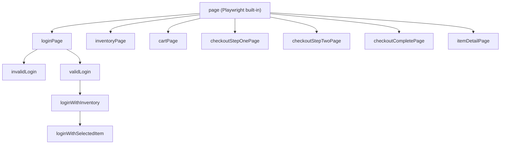

# KB: test-base.ts — Custom Fixtures Explained

> **Knowledge Base Article** | Framework: AdvancePlaywrightFramework2x  
> File: `src/fixtures/test-base.ts`

---

## 🗺️ The Big Picture

`test-base.ts` is the **wiring hub** of the entire framework. It connects Playwright's built-in test runner with all our page objects and reusable test states.

```
┌─────────────────────────────────────────────────────────┐
│                    test-base.ts                         │
│                                                         │
│  Playwright's base ──► EXTENDED WITH ──► Our custom     │
│  test + expect          (fixtures)        test + expect │
│                                                         │
│  Every test imports from HERE, not from @playwright/test│
└─────────────────────────────────────────────────────────┘
```

Instead of `import { test } from '@playwright/test'`, all tests do:

```typescript
import { test, expect } from '../fixtures/test-base';
```

---

## Section 1: The JSDoc Comment (Lines 1–19)

This is the built-in documentation. It tells developers:

- **What this file is**: A custom `test` object pre-wired with all TTACart page objects.
- **Why use it**: Instead of writing `new LoginPage(page)` in every single test, you just ask for `loginPage` as a parameter and it's handed to you — already constructed.
- **Two kinds of fixtures**:

| Kind | Description | Example |
|---|---|---|
| **Plain page-object fixtures** | Hand you a constructed object — no navigation happens | `loginPage`, `inventoryPage`, `cartPage` |
| **State fixtures** | Perform setup actions automatically when a test asks for them | `invalidLogin`, `validLogin`, `loginWithInventory`, `loginWithSelectedItem` |

---

## Section 2: Imports (Lines 21–31)

```typescript
import { test as base, expect } from '@playwright/test';
```

> 🎯 **The key trick**: We import Playwright's built-in `test` but **rename it to `base`**. We then extend it with our own fixtures and export the extended version as `test`. The original is kept as `base` for internal use only.

Then we import all 7 page objects and the login test data JSON file:

```typescript
import { LoginPage } from '@pages/LoginPage';
import { InventoryPage } from '@pages/InventoryPage';
import { ItemDetailPage } from '@pages/ItemDetailPage';
import { CartPage } from '@pages/CartPage';
import { CheckoutStepOnePage } from '@pages/CheckoutStepOnePage';
import { CheckoutStepTwoPage } from '@pages/CheckoutStepTwoPage';
import { CheckoutCompletePage } from '@pages/CheckoutCompletePage';
import loginTestData from '@testdata/logintestdata.json';
```

---

## Section 3: Type Definitions (Lines 34–46)

### `LoginRecord` — Shape of JSON data

```typescript
type LoginRecord = {
    username: string;
    password: string;
};
```

Matches the structure in `logintestdata.json`:
```json
{ "username": "standard_user", "password": "tta_secret" }
```

### `InvalidLoginState` — What `invalidLogin` fixture provides

```typescript
export type InvalidLoginState = {
    loginPage: LoginPage;
    username: string;
};
```

When a test asks for `invalidLogin`, it gets **both** the login page (still showing the error) **and** the username that caused it. This lets the test verify error messages against the specific locked-out user.

### `SelectedItemState` — What `loginWithSelectedItem` fixture provides

```typescript
export type SelectedItemState = {
    inventoryPage: InventoryPage;
    itemId: string;
};
```

When a test asks for `loginWithSelectedItem`, it gets the inventory page (with an item already added to cart) **plus** the ID of that item — useful for cross-checking in cart tests.

---

## Section 4: Constants from Test Data (Lines 48–55)

```typescript
const users = loginTestData as LoginRecord[];
const validUser = users.find(({ username }) => username === 'standard_user');
const invalidUser = users.find(({ username }) => username === 'locked_out_user');
const SELECTED_ITEM_ID = 'test-allthethings-tshirt-red';
```

| Constant | Value | Used By |
|---|---|---|
| `validUser` | `standard_user` credentials | `validLogin`, `loginWithInventory` |
| `invalidUser` | `locked_out_user` credentials | `invalidLogin` |
| `SELECTED_ITEM_ID` | `test-allthethings-tshirt-red` | `loginWithSelectedItem` |

> 💡 These are extracted at **import time** (framework startup), not at test time. The guard below ensures the framework **fails fast** if data is corrupted — better to crash at startup than mid-test.

```typescript
if (!validUser || !invalidUser) {
    throw new Error('Required standard_user and locked_out_user test data is missing');
}
```

---

## Section 5: The `TestFixture` Type (Lines 58–73)

```typescript
export type TestFixture = {
    // Page Objects
    loginPage: LoginPage;
    inventoryPage: InventoryPage;
    itemDetailPage: ItemDetailPage;
    cartPage: CartPage;
    checkoutStepOnePage: CheckoutStepOnePage;
    checkoutStepTwoPage: CheckoutStepTwoPage;
    checkoutCompletePage: CheckoutCompletePage;

    // Ready-to-use application states
    invalidLogin: InvalidLoginState;
    validLogin: LoginPage;
    loginWithInventory: InventoryPage;
    loginWithSelectedItem: SelectedItemState;
};
```

This is a **TypeScript contract**. It tells the compiler: _"These are the named fixtures that every test can request."_ Without it, your IDE wouldn't autocomplete fixture names, and TypeScript would complain about unknown properties.

---

## Section 6: The Core — `base.extend<TestFixture>({...})` (Lines 75–135)

This is where the magic happens. `base.extend()` takes our plain Playwright `test` and **adds our custom fixtures to it**.

---

### 6a. Page Object Fixtures (Lines 77–98)

```typescript
loginPage: async ({ page }, use) => {
    await use(new LoginPage(page));
},
```

Pattern for every page:
1. **`{ page }`** — Destructure Playwright's built-in `page` fixture (the browser tab).
2. **`new LoginPage(page)`** — Construct the page object, passing it the `page` instance.
3. **`await use(...)`** — Hand the constructed object to the test.

> 🎯 **Why `await use()` instead of `return`?**  
> Playwright fixtures support **teardown** — any code placed *after* `await use()` runs when the test finishes. This is where you'd put cleanup logic. Our page objects don't need cleanup, but the pattern leaves the door open for future needs.

All 7 pages follow the same pattern:

| Fixture Name | Constructs |
|---|---|
| `loginPage` | `new LoginPage(page)` |
| `inventoryPage` | `new InventoryPage(page)` |
| `itemDetailPage` | `new ItemDetailPage(page)` |
| `cartPage` | `new CartPage(page)` |
| `checkoutStepOnePage` | `new CheckoutStepOnePage(page)` |
| `checkoutStepTwoPage` | `new CheckoutStepTwoPage(page)` |
| `checkoutCompletePage` | `new CheckoutCompletePage(page)` |

---

### 6b. `invalidLogin` Fixture (Lines 102–107)

```typescript
invalidLogin: async ({ page, loginPage }, use) => {
    await loginPage.open();
    await loginPage.loginAs(invalidUser.username, invalidUser.password);
    await expect(page.locator('[data-test="error"]')).toBeVisible();
    await use({ loginPage, username: invalidUser.username });
},
```

| Step | Action |
|---|---|
| 1 | Opens the login page |
| 2 | Logs in as `locked_out_user` (invalid credentials) |
| 3 | **Asserts** the error message IS visible |
| 4 | Hands over `{ loginPage, username }` to the test |

**When would you use it?** → Testing error messages, locked-out behavior, negative scenarios.

---

### 6c. `validLogin` Fixture (Lines 111–116)

```typescript
validLogin: async ({ loginPage }, use) => {
    await loginPage.open();
    await loginPage.loginAs(validUser.username, validUser.password);
    await loginPage.waitForLoginButtonHidden();
    await use(loginPage);
},
```

| Step | Action |
|---|---|
| 1 | Opens the login page |
| 2 | Logs in as `standard_user` (valid credentials) |
| 3 | Waits for login button to disappear (confirms successful navigation) |
| 4 | Hands over the `loginPage` to the test |

**When would you use it?** → Any test that needs to be logged in first.

---

### 6d. `loginWithInventory` Fixture (Lines 120–124)

```typescript
loginWithInventory: async ({ validLogin, inventoryPage }, use) => {
    void validLogin;
    await inventoryPage.assertLoaded();
    await use(inventoryPage);
},
```

| Step | Action |
|---|---|
| 1 | **Depends on `validLogin`** — inherits the logged-in state |
| 2 | Calls `inventoryPage.assertLoaded()` to confirm we're on the inventory page |
| 3 | Hands over the `inventoryPage` to the test |

> 💡 **`void validLogin;`** — This line explicitly declares the dependency on `validLogin`. Without referencing it, Playwright might not run `validLogin` first. The `void` tells TypeScript "I know I'm not using this value, that's intentional."

**When would you use it?** → Any test that needs to be on the inventory/product listing page.

---

### 6e. `loginWithSelectedItem` Fixture (Lines 128–135)

```typescript
loginWithSelectedItem: async ({ loginWithInventory }, use) => {
    await loginWithInventory.addToCart(SELECTED_ITEM_ID);
    await use({
        inventoryPage: loginWithInventory,
        itemId: SELECTED_ITEM_ID,
    });
},
```

| Step | Action |
|---|---|
| 1 | **Depends on `loginWithInventory`** — logged in + on inventory page |
| 2 | Clicks "Add to Cart" for the pre-selected item |
| 3 | Hends over `{ inventoryPage, itemId }` to the test |

**When would you use it?** → Cart tests, checkout tests — anything needing an item already in the cart.

---

## Section 7: Re-export `expect` (Line 139)

```typescript
export { expect };
```

We re-export Playwright's `expect` so that tests only need **one import**:

```typescript
import { test, expect } from '../fixtures/test-base';
//     ^^^^              ^^^^^^^
//     Our custom one    Playwright's, passed through
```

---

## 🔗 Fixture Dependency Chain



---

## ⚝ How Tests Use These Fixtures

### ExampleA: Testing invalid login

```typescript
import { test, expect } from '../fixtures/test-base';

test('should show error for locked-out user', async ({ invalidLogin }) => {
    // invalidLogin already ran: opened page, logged in, got error
    await expect(invalidLogin.loginPage.errorBox).toContainText('locked out');
});
```

### ExampleB: Testing checkout with a pre-added item

```typescript
import { test, expect } from '../fixtures/test-base';

test('should checkout with preselected item', async ({
    loginWithSelectedItem,
    cartPage,
    checkoutStepOnePage,
}) => {
    // loginWithSelectedItem: logged in + item already in cart
    await cartPage.open);
    await cartPage.checkout();

    await checkoutStepOnePage.fillCustomerInfo(/* ... */);
    // ...
});
```

---

## 📝 Summary Cheat Sheet

| Concept | What It Means |
|---|---|
| `base.extend()` | Adds our custom fixtures to Playwright's test |
| `TestFixture` type | Tells TypeScript what fixtures exist |
| Page fixtures | Just construct & hand over — no actions performed |
| State fixtures | Perform setup actions (login, add to cart) before test runs |
| `await use(...)` | Hends fixture value to test; code after it is teardown |
| `void validLogin;` | Exlicitly declares a fixture dependency without using the value |
| Re-export `expect` | One import for everything |
| JSON at import time | Credentials loaded once at startup, not per-test |

---

## 🔑 Key Takeaways

1. **Never import from `@playwright/test` directly in test files** — always import from `../fixtures/test-base`.
2. **State fixtures are lazy** — they only run when a test actually requests them. If no test asks for `invalidLogin`, it never executes.
3. **Fixtures compose** — `loginWithInventory` depends on `validLogin`, which depends on `loginPage`, which depends on `page`. The chain resolves automatically.
4. **Teardown is built-in** — add cleanup code after `await use()` in any fixture, and Playwright runs it when the test finishes.
5. **Fast-fail guard** — If `standard_user` or `locked_out_user` is missing from `logintestdata.json`, the entire test suite fails at startup with a clear error message.