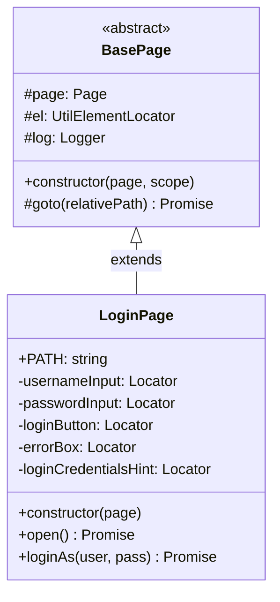
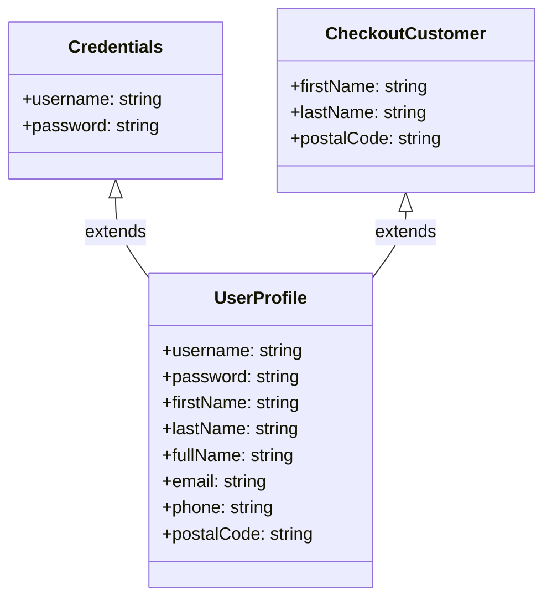
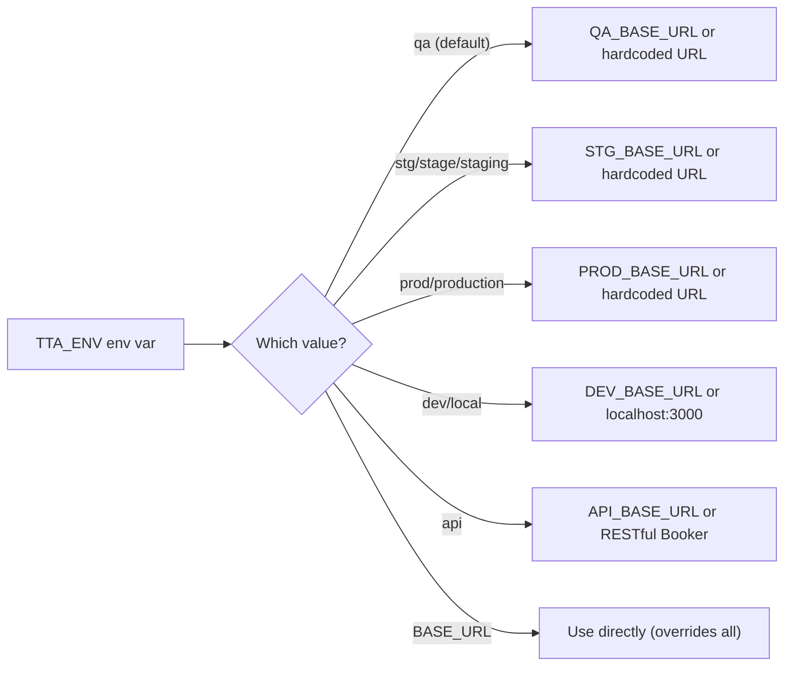
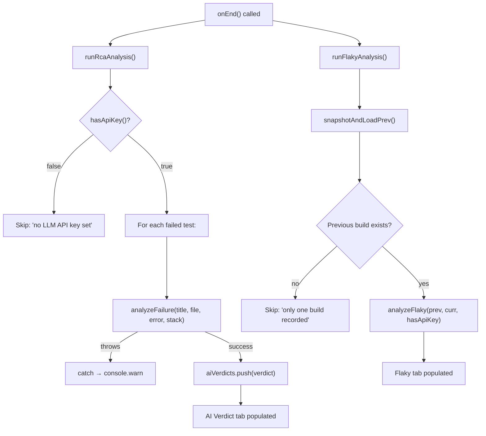
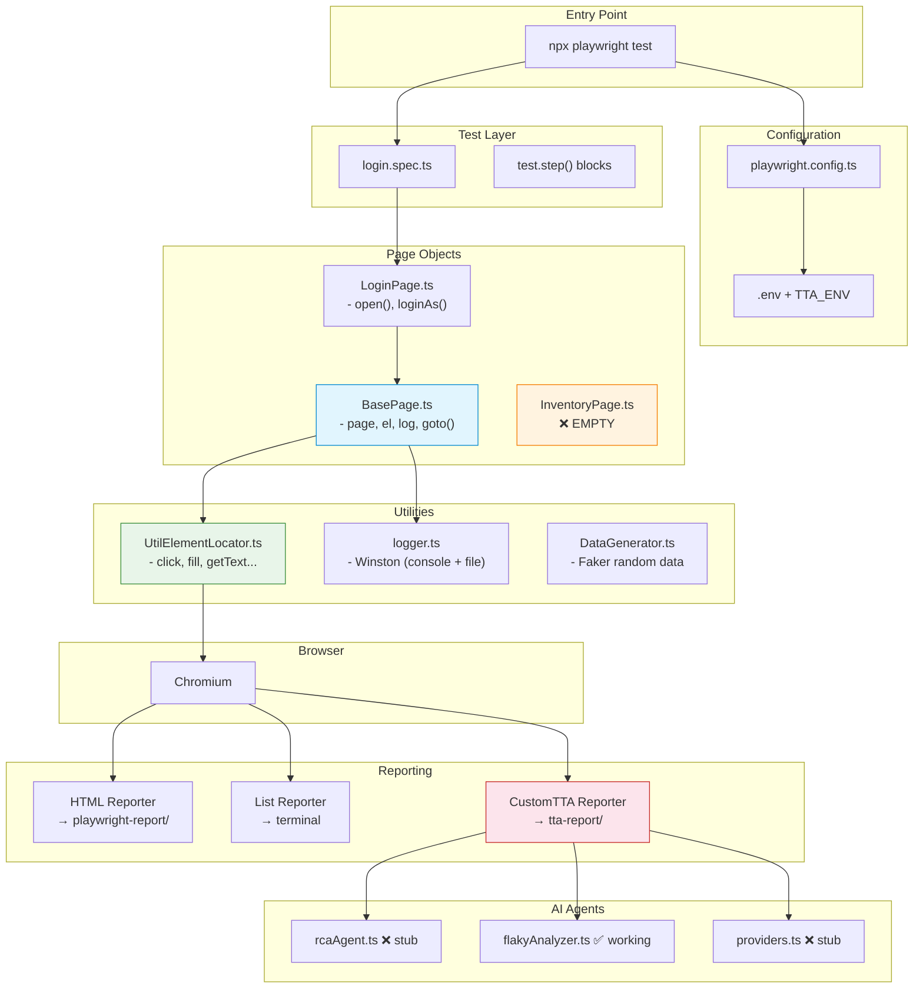

# 🔬 Advance Playwright Framework 2x — Deep Dive (All Components)

> **No code changes. Documentation only.**

---

## Table of Contents

1. [BasePage & LoginPage — Page Object Model](#1-basepage--loginpage--page-object-model)
2. [UtilElementLocator — The Action Wrapper](#2-utilelementlocator--the-action-wrapper)
3. [login.spec.ts — Test Structure](#3-loginspects--test-structure)
4. [logger.ts — Winston Logging](#4-loggerts--winston-logging)
5. [DataGenerator.ts — Faker Test Data](#5-datageneratorts--faker-test-data)
6. [playwright.config.ts — Configuration](#6-playwrightconfigts--configuration)
7. [CustomReporter.ts — Custom HTML Reporting](#7-customreporterts--custom-html-reporting)
8. [AI Agents (rcaAgent, flakyAnalyzer, providers)](#8-ai-agents-rcaagent-flakyanalyzer-providers)
9. [The 6 Empty Page Stubs](#9-the-6-empty-page-stubs)

---

## 1. BasePage & LoginPage — Page Object Model

### `BasePage.ts` — The Foundation



**`BasePage`** is an `abstract` class that every page object extends. It provides exactly four things and nothing more — it's intentionally thin:

| Field | Type | Source | Purpose |
|-------|------|--------|---------|
| `this.page` | `Page` | Constructor param | Raw Playwright page handle for navigation and assertions |
| `this.el` | `UtilElementLocator` | Created internally with `(page, scope)` | Wraps all Playwright actions with logging + timeouts |
| `this.log` | `winston.Logger` | `createLogger(scope)` | Scoped Winston logger — tag shows which page emitted the log |
| `this.goto(path)` | Method | Defined in BasePage | Navigates to `baseURL + path`, waits for `domcontentloaded` |

**Key design decisions:**
- The constructor is `protected` — only subclasses can call `super(page, scope)`.
- `scope` is passed as a string (e.g., `'LoginPage'`) and becomes the Winston child logger tag.
- No locators are defined in `BasePage`. Each subclass declares its own `private readonly` fields with `data-test` selectors.
- The `goto()` helper uses `this.page.goto(relativePath)` which Playwright automatically resolves against `baseURL` from `playwright.config.ts`.

### `LoginPage.ts` — Example Implementation

Every page object follows this exact contract:

```
1. extends BasePage
2. static readonly PATH = '/relative/url'
3. private readonly locators declared in constructor
4. All locators use data-test selectors only
5. All interactions via this.el.* (not raw page.locator())
6. Assertions stay OUT of page objects (they go in test files)
```

**Constructor wiring:**
```typescript
constructor(page: Page) {
    super(page, 'LoginPage');          // → BasePage creates el + log
    this.usernameInput = page.locator('[data-test="username"]');
    this.passwordInput = page.locator('[data-test="password"]');
    this.loginButton   = page.locator('[data-test="login-button"]');
    this.errorBox      = page.locator('[data-test="error"]');
    this.loginCredentialsHint = page.locator('[data-test="login-credentials"]');
}
```

**Methods:**
- `open()` — calls `this.goto(LoginPage.PATH)`, logs `"Open login pgae"` (note: typo)
- `loginAs(username, password)` — fills username, fills password, clicks login button — all through `this.el.*`

**Why `this.el` instead of raw Playwright?** See the next section.

---

## 2. UtilElementLocator — The Action Wrapper

### The Problem It Solves

Without this wrapper, you'd write:
```typescript
await page.locator('[data-test="username"]').fill('standard_user', { timeout: 15000 });
// No logging. Have to remember timeout syntax everywhere. Verbose.
```

With the wrapper, you write:
```typescript
await this.el.fill(this.usernameInput, 'standard_user');
// Auto-logs: "2026-08-13 10:00:00 [debug] [LoginPage] fill Locator@[data-test="username"]"
// 15s timeout auto-applied.
```

### Architecture

```
┌─────────────────────────────────────────────────┐
│              UtilElementLocator                   │
│                                                   │
│  Flex = string | Locator   ← accepts either       │
│                                                   │
│  toLocator(target) → Locator  ← private helper    │
│  describe(target) → string    ← for log lines     │
│                                                   │
│  ┌─ Mouse ─────────────────────────────────────┐ │
│  │ click, doubleClick, rightClick, hover       │ │
│  ├─ Input ─────────────────────────────────────┤ │
│  │ fill, type, clear, pressSequentially        │ │
│  ├─ Getters ───────────────────────────────────┤ │
│  │ getText, getInnerText, getAllTexts, getAttr,│ │
│  │ getValue                                     │ │
│  ├─ State ─────────────────────────────────────┤ │
│  │ count, isVisible, isEnabled, isChecked      │ │
│  ├─ Waits ─────────────────────────────────────┤ │
│  │ waitForVisible, waitForHidden, waitForPageLoad│ │
│  └─ Selects ───────────────────────────────────┘ │
│  │ selectByText, selectByValue, selectByIndex   │ │
│                                                   │
│  DEFAULT_ACTION_TIMEOUT_MS = 15_000              │
└─────────────────────────────────────────────────┘
```

### The `Flex` Type

```typescript
export type Flex = string | Locator;
```

You can pass either:
- A **CSS string**: `'[data-test="username"]'`
- A **Playwright Locator**: `page.getByTestId('username')`

The private `toLocator()` method normalizes both into a `Locator`:
```typescript
private toLocator(target: Flex): Locator {
    return typeof target === 'string' ? this.page.locator(target) : target;
}
```

### `type()` vs `pressSequentially()`

Playwright deprecated `locator.type()` in favor of `locator.pressSequentially()`. This wrapper:
- Keeps `type()` as a public method (familiar API for students) but internally calls `pressSequentially()`
- Also exposes `pressSequentially()` directly for those who want the canonical name

### `waitForPageLoad()` — Smart Waiting

```typescript
async waitForPageLoad(): Promise<void> {
    await this.page.waitForLoadState('domcontentloaded');
    await this.page.waitForLoadState('networkidle').catch(() => {
        // Swallow rare timeouts from background analytics calls
    });
}
```

Waits for DOM ready, then for network idle — but **swallows** the `networkidle` timeout so background analytics pings on the demo site don't punish the test.

### `waitForVisible` / `waitForHidden` — Using `expect`

These use Playwright's `expect(loc).toBeVisible({ timeout })` assertions rather than `locator.waitFor()`. This means they respect the assertion timeout and produce better error messages.

---

## 3. login.spec.ts — Test Structure

### The Pattern

Every test spec follows this structure:

```typescript
import { test, expect } from '@playwright/test';
import { LoginPage } from '@pages/LoginPage';
import { createLogger } from '@utils/logger';

const log = createLogger('login.spec');  // Module-level logger

test.describe('TTACart - Login', () => {
    let loginPage: LoginPage;

    test.beforeEach(async ({ page }) => {
        loginPage = new LoginPage(page);          // Create PO here, not in fixtures
        await test.step('Open the TTACart login page', async () => {
            log.info('Opening the TTACart login page');
            await loginPage.open();
        });
    });

    test('logs in with valid credentials @p0', async ({ page }) => {
        await test.step('Login as standard_user', async () => {
            await loginPage.loginAs('standard_user', 'tta_secret');
        });
        await test.step('Verify login form is no longer shown', async () => {
            await expect(page.locator('[data-test="login-button"]')).toBeHidden();
        });
    });
});
```

### Key Conventions

| Convention | Why |
|---|---|
| `test.describe()` grouping | Organizes related tests, visible in reporters |
| `test.beforeEach()` for setup | Each test gets a fresh page object instance |
| `test.step()` wrapping | Every logical action is a step → visible in trace viewer & CustomReporter |
| `@p0` / `@p1` / `@smoke` tags | Appended to test name string, parsed as tags for filtering |
| Assertions in test, NOT in page objects | Separation of concerns — POs do actions, tests do verification |
| `const log = createLogger('login.spec')` | Module-level scoped logger |
| No custom fixtures | Page objects are created imperatively in `beforeEach` |

### Assertion Pattern

Assertions use `data-test` selectors directly in the test, not methods on page objects:
```typescript
await expect(page.locator('[data-test="login-button"]')).toBeHidden();
```

---

## 4. logger.ts — Winston Logging

### Architecture

```
process.env.LOG_LEVEL ('info')
         │
         ▼
┌────────────────────┐
│  Root logger       │
│  format: timestamp  │
│  + level + scope    │──→ Console (colorized)
│  + message          │──→ File (logs/combined.log)
└────────┬───────────┘
         │ logger.child({ scope: 'LoginPage' })
         ▼
┌────────────────────┐
│  Child logger      │  ← Used by BasePage, tests, utils
│  scope = "LoginPage"│
└────────────────────┘
```

### Log Line Format

```
2026-08-13 10:00:00 [info] [LoginPage] Open login pgae
2026-08-13 10:00:01 [debug] [LoginPage] fill Locator@[data-test="username"]
2026-08-13 10:00:02 [debug] [LoginPage] click Locator@[data-test="login-button"]
```

The format is: `TIMESTAMP [LEVEL] [SCOPE] MESSAGE`

### Key Implementation Details

- **Environment control**: `LOG_LEVEL` env var (default: `'info'`) — set to `'debug'` for verbose output
- **Dual transport**: Console (with ANSI colorization via `colorize()`) + File (`logs/combined.log` plain text)
- **Error stacking**: `errors({ stack: true })` includes stack traces when logging error objects
- **Child loggers**: `createLogger(scope)` → `logger.child({ scope })` — every child carries its scope as metadata
- **Type export**: `export type Logger = winston.Logger` for convenient type-only imports

### Who Uses What

| Component | Scope | How |
|-----------|-------|-----|
| `BasePage` | Subclass name (e.g., `'LoginPage'`) | `createLogger(scope)` in constructor |
| `UtilElementLocator` | Same as parent Page scope | Passed from BasePage constructor |
| `login.spec.ts` | `'login.spec'` | Module-level `const log = createLogger('login.spec')` |
| `CustomReporter` | Uses `console.log` directly (not Winston) | Reporter lifecycle |

---

## 5. DataGenerator.ts — Faker Test Data

### Interfaces



### Method Map

| Method | Returns | Faker API Used | Example Output |
|--------|---------|---------------|----------------|
| `username()` | `string` | `faker.internet.username()` | `"Otilia35"` |
| `password(length)` | `string` | `faker.internet.password({ length })` | `"a1b2c3d4e5f6"` |
| `credentials()` | `Credentials` | Composes above two | `{ username, password }` |
| `firstName()` | `string` | `faker.person.firstName()` | `"John"` |
| `lastName()` | `string` | `faker.person.lastName()` | `"Doe"` |
| `email()` | `string` | `faker.internet.email()` | `"john.doe@example.com"` |
| `phone()` | `string` | `faker.phone.number()` | `"+1-555-123-4567"` |
| `postalCode()` | `string` | `faker.location.zipCode()` | `"90210"` |
| `checkoutCustomer()` | `CheckoutCustomer` | Composes name + zip | `{ firstName, lastName, postalCode }` |
| `userProfile()` | `UserProfile` | Composes everything | Full profile with derived `fullName` |

### Important: Faker Version

The `package.json` specifies `"@faker-js/faker": "^10.5.0"` — this is Faker **v10**. The code uses the v9+ API:
- ✅ `faker.internet.username()` (v9+) 
- ✅ `faker.location.zipCode()` (v9+)
- ✅ `faker.person.firstName()` (v9+)

The JSDoc comment in `DataGenerator.ts` incorrectly says "Faker v8 API notes" — this is outdated. The installed version is v10.

### Composite Methods

`userProfile()` is the most interesting — it generates `firstName` and `lastName` once, then derives:
- `fullName` from concatenation: `${firstName} ${lastName}`
- `email` using Faker's email generator with the real names: `faker.internet.email({ firstName, lastName })`

This ensures all fields are consistent rather than independently random.

---

## 6. playwright.config.ts — Configuration

### Environment Resolution: `resolveBaseURL()`



**Priority:**
1. `BASE_URL` env var (explicit override)
2. `TTA_ENV` → maps to `QA_BASE_URL`, `STG_BASE_URL`, `PROD_BASE_URL`, etc.
3. Hardcoded fallback URLs

**Example usage:**
```bash
TTA_ENV=staging npx playwright test    # → https://stage.thetestingacademy.com
TTA_ENV=prod npx playwright test       # → https://app.thetestingacademy.com
BASE_URL=https://custom.com npx playwright test  # → overrides everything
```

### Config Breakdown

| Setting | Value | Why |
|---------|-------|-----|
| `testDir` | `'./src/tests'` | Only runs files in this directory |
| `timeout` | `60_000` (60s) | Per-test timeout |
| `expect.timeout` | `10_000` (10s) | Per-assertion timeout |
| `fullyParallel` | `true` | All tests run in parallel |
| `retries` | `2` (CI) / `0` (local) | Auto-retry in CI, fail fast locally |
| `reporter` | `['html', 'list', './src/utils/CustomReporter.ts']` | Three reporters run simultaneously |
| `screenshot` | `'only-on-failure'` | Capture screenshot only when test fails |
| `video` | `'on'` | Always record video |
| `trace` | `'on'` | Always record trace |
| `projects` | `chromium` only | Single browser — extendable |

### ⚠️ Critical Note: `dotenv.config()`

Called at the **top** of the config file (line 4), before any env vars are read. This means `.env` file values are available throughout the config.

### ⚠️ Path Aliases at Runtime

The `tsconfig.json` has `paths` configured, but **Node.js doesn't resolve TypeScript path aliases natively**. Playwright Test uses its own built-in TypeScript transformer (`@playwright/test` ships with one), which is why `@pages/LoginPage` and `@utils/logger` work when running tests. However, if these files were compiled with `tsc` independently, the aliases would break.

---

## 7. CustomReporter.ts — Custom HTML Reporting

### Overview

A **2,371-line** self-contained Playwright `Reporter` implementation written by Pankaj Chute at The Testing Academy. It generates a real-time HTML report in `tta-report/` and is registered as the third reporter in `playwright.config.ts`.

### Lifecycle — When Each Method Fires

```
┌──────────────┐
│  onBegin()   │  Prints banner, initializes live report file, starts 5s refresh
└──────┬───────┘
       │
       ▼
┌──────────────┐
│onTestBegin() │  Records start time, adds "running" row to live report
└──────┬───────┘
       │
       ▼ (repeated per step)
┌──────────────┐
│onStepBegin() │  Prints ⏳ step title to terminal
│onStepEnd()   │  Prints ✅/❌ + duration, records StepData with video timestamps
└──────┬───────┘
       │
       ▼
┌──────────────┐
│ onTestEnd()  │  Collects screenshots, videos, traces, logs, AI data
│              │  Associates screenshots with steps by pattern matching
│              │  Updates suite stats & file groups
│              │  Calls updateReportRealTime()
└──────┬───────┘
       │ (all tests complete)
       ▼
┌──────────────┐
│  onEnd()     │  Prints final summary banner
│              │  → runRcaAnalysis()  (RCA AI for failed tests)
│              │  → runFlakyAnalysis() (diff vs previous build)
│              │  → generateReport()  (writes final HTML, index.html, history.html)
└──────────────┘
```

### Real-Time Updating

During execution, the report file is rewritten every time a step completes. A `<meta http-equiv="refresh" content="5">` tag in the HTML auto-refreshes every 5 seconds. Once all tests finish, the refresh tag is removed and the final report is written.

### Generated Report Structure

```
tta-report/
├── index.html           ← Redirect to latest report
├── history.html         ← Historical report listing
├── report_YYYYMMDD_HHMMSS.html  ← Full self-contained report
├── screenshots/         ← Copied from test artifacts
├── videos/              ← Copied from test artifacts
└── traces/              ← Copied from test artifacts
```

### HTML Report Sections

| Section | Content |
|---------|---------|
| **Header** | Gradient banner with title, animated background pulse |
| **Stats Dashboard** | 6 stat cards: Total, Passed, Failed, Skipped, Pass Rate %, Duration |
| **Meta Bar** | Environment badge, browser, platform, workers, run ID, start time |
| **Filters** | Priority checkboxes (All/P0/P1/Smoke), Status checkboxes (All/Passed/Failed/Skipped) |
| **Test Table** | 14-column table with S.No, Suite, Test Name, Author, Priority, Tags, File, Start/End Time, Duration, Status, Screenshot, Video, Trace |
| **Detail Panel** | Expandable per-test panel with: Error section, Logs, Step details (with console output, per-step screenshots, video timestamps), Screenshots grid, Video player, Trace download |
| **AI Data Tab** | JSON cards for `ai-data` attachments |
| **AI Verdict Tab** | RCA cards with severity, priority, root cause, fixes |
| **Flaky Tab** | Build comparison: flaky/failing/total counts, flaky test list, AI summary |

### Screenshot-to-Step Association

The reporter uses pattern matching to associate screenshots with steps:
1. Checks if screenshot name starts with `step-N-` pattern
2. Checks if name contains `step_N_` or `step N`
3. Falls back to substring matching against step title

### `renderExternalRun()` — Cucumber/Other Runners

A public method that allows non-Playwright runners (e.g., Cucumber) to feed their own `TestData[]` into the same HTML + RCA + Flaky pipeline:
```typescript
await reporter.renderExternalRun({
    runId: 'custom-run',
    startTime: new Date(),
    endTime: new Date(),
    tests: myTestData,
    stats: myStats,
    meta: { browser: 'chrome', workers: 4 }
});
```

### Flaky Analysis: `snapshotAndLoadPrev()`

Each run writes a JSON snapshot to `reports/runs/run-YYYYMMDD_HHMMSS.json` containing every test's status. The previous run's snapshot is loaded for comparison.

---

## 8. AI Agents (rcaAgent, flakyAnalyzer, providers)

### `flakyAnalyzer.ts` — ✅ Fully Functional

The **only fully working** AI agent. Does a deterministic diff:

```typescript
// Given:
prev.tests = { "test A": "passed", "test B": "failed" }
curr.tests = { "test A": "failed", "test B": "failed" }

// Result:
// test A flipped passed→failed → marked as FLAKY
// test B stayed failed → NOT flaky (consistent)
```

**How it's called** from `CustomReporter`:
1. `snapshotAndLoadPrev()` reads the previous run's JSON from `reports/runs/`
2. Writes current run's JSON
3. Calls `analyzeFlaky(prev, curr, hasApiKey())`
4. Returns `FlakyResult` with flaky test names and counts

### `rcaAgent.ts` — ❌ Stub

```typescript
export async function analyzeFailure(_input): Promise<RcaVerdict> {
    throw new Error('RCA agent: no LLM backend configured.');
}
```

- Defines the `RcaVerdict` interface: `severity` (critical/high/medium/low), `priority`, `rootCause`, `fixes[]`
- The actual function **always throws** — it's a placeholder
- The `CustomReporter` wraps the call in try/catch, so it never crashes the run
- The reporter ALSO checks `hasApiKey()` first — since it always returns `false`, RCA is always skipped

### `providers.ts` — ❌ Stub

```typescript
export function hasApiKey(): boolean {
    return false;  // Always returns false — no LLM backend configured
}
```

**To wire real AI:**
1. Replace `hasApiKey()` to check for an API key (e.g., `process.env.OPENAI_API_KEY`)
2. Replace `analyzeFailure()` to call an LLM (OpenAI/Anthropic) with the error details
3. Optionally enhance `analyzeFlaky()` to add LLM-generated summaries

### How the Reporter Uses AI: Complete Flow



---

## 9. The 6 Empty Page Stubs

These files exist on disk but contain **zero lines of code**:

| File | Purpose | Status |
|------|---------|--------|
| `InventoryPage.ts` | Product listing page — shows all items with add-to-cart buttons | ❌ Empty |
| `ItemDetailPage.ts` | Single item detail view — shows description, price, add-to-cart | ❌ Empty |
| `CartPage.ts` | Shopping cart — shows added items, quantities, remove buttons | ❌ Empty |
| `CheckoutStepOnePage.ts` | Checkout form — first name, last name, postal code inputs | ❌ Empty |
| `CheckoutStepTwoPage.ts` | Order overview — shows items, total, finish button | ❌ Empty |
| `CheckoutCompletePage.ts` | Order confirmation — success message, back-to-home button | ❌ Empty |

### What Each Would Need to Follow the Pattern

Each would:
1. `extend BasePage`
2. Define `static readonly PATH`
3. Declare `private readonly` locators in constructor using `data-test` selectors
4. Expose action methods via `this.el.*`
5. NOT contain assertions

### Required `data-test` Attributes (for TTACart - SauceDemo-style)

Based on SauceDemo patterns, the expected selectors would be:

| Page | Likely `data-test` attributes |
|------|------------------------------|
| Inventory | `inventory-container`, `add-to-cart-sauce-labs-backpack`, `shopping-cart-link`, `shopping-cart-badge` |
| Item Detail | `back-to-products`, `item-title`, `item-price`, `item-description`, `add-to-cart` |
| Cart | `cart-list`, `cart-item`, `remove-sauce-labs-backpack`, `checkout`, `continue-shopping` |
| Checkout One | `firstName`, `lastName`, `postalCode`, `continue`, `cancel` |
| Checkout Two | `summary-info`, `subtotal-label`, `tax-label`, `total-label`, `finish`, `cancel` |
| Checkout Complete | `checkout-complete-container`, `complete-header`, `complete-text`, `back-to-products` |

---

## 📊 Component Interaction Map (Full System)



---

## 🔑 Summary of All Key Files

| File | Lines | Purpose |
|------|-------|---------|
| `BasePage.ts` | 34 | Abstract foundation for all pages |
| `LoginPage.ts` | 42 | Only implemented page object |
| `UtilElementLocator.ts` | 185 | Core action wrapper with 20+ methods |
| `logger.ts` | 68 | Winston logger with dual transport |
| `DataGenerator.ts` | 110 | Faker-backed test data generator |
| `login.spec.ts` | 31 | Login test with `test.step` pattern |
| `playwright.config.ts` | 65 | Config with env switching, 3 reporters |
| `CustomReporter.ts` | 2,371 | Self-contained HTML reporter |
| `rcaAgent.ts` | 22 | RCA stub (throws Error) |
| `flakyAnalyzer.ts` | 36 | Working flaky detector |
| `providers.ts` | 12 | API key check stub (returns false) |
| `tsconfig.json` | 45 | TypeScript config with path aliases |
| `CartPage.ts` | 0 | Empty stub |
| `CheckoutStepOnePage.ts` | 0 | Empty stub |
| `CheckoutStepTwoPage.ts` | 0 | Empty stub |
| `CheckoutCompletePage.ts` | 0 | Empty stub |
| `InventoryPage.ts` | 0 | Empty stub |
| `ItemDetailPage.ts` | 0 | Empty stub |