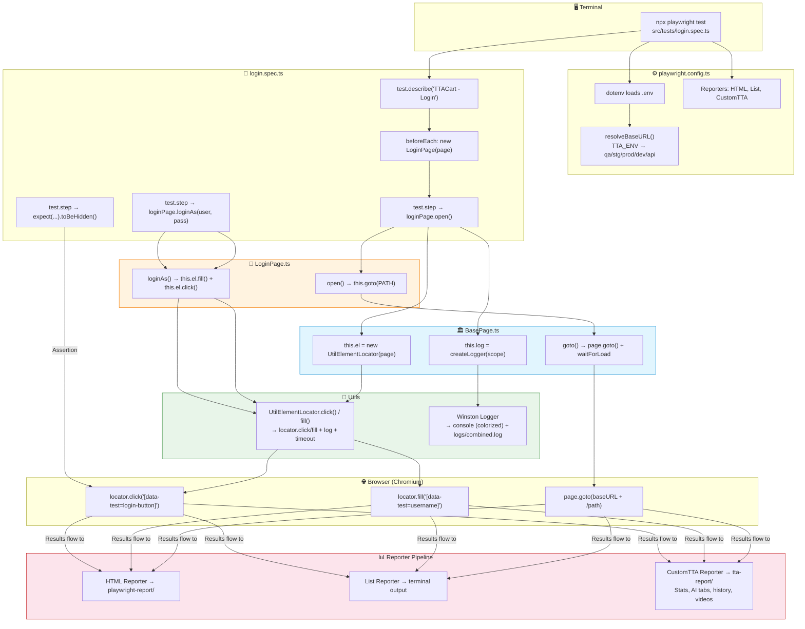

# Advance Playwright Framework 2x — Project Structure Explained

This is a **Playwright + TypeScript** end-to-end test framework for testing the **TTACart** storefront app (a SauceDemo-style shopping site). It follows the **Page Object Model (POM)** pattern and uses a custom action wrapper (`UtilElementLocator`) for consistent, logged interactions.

---

## 📁 Folder Structure — Top-Down

```
AdvancePlaywrightFramework2x/
│
├── 📄 package.json              ← Dependencies (Playwright, Faker, Winston, etc.)
├── 📄 playwright.config.ts      ← Test runner configuration (timeouts, browser, reporters)
├── 📄 tsconfig.json             ← TypeScript config (path aliases: @pages/*, @utils/*, etc.)
├── 📄 README.md                 ← Full documentation
├── 📄 AGENTS.md                 ← AI coding agent quickstart guide
│
├── 📁 .github/workflows/        ← CI/CD
│   └── playwright.yml           ← GitHub Actions: install → test → upload report
│
├── 📁 src/                      ← ⭐ ALL source code lives here
│   │
│   ├── 📁 pages/                ← Page Object Model classes
│   │   ├── BasePage.ts          ← ✅ Abstract base: provides page, el, log, goto()
│   │   ├── LoginPage.ts         ← ✅ IMPLEMENTED — login screen
│   │   ├── InventoryPage.ts     ← ❌ EMPTY stub
│   │   ├── CartPage.ts          ← ❌ EMPTY stub
│   │   ├── ItemDetailPage.ts    ← ❌ EMPTY stub
│   │   ├── CheckoutStepOnePage.ts ← ❌ EMPTY stub
│   │   ├── CheckoutStepTwoPage.ts ← ❌ EMPTY stub
│   │   └── CheckoutCompletePage.ts ← ❌ EMPTY stub
│   │
│   ├── 📁 tests/                ← Test spec files
│   │   ├── login.spec.ts        ← Login tests (uses LoginPage)
│   │   └── example.spec.ts      ← Stock Playwright demo (tests playwright.dev, not TTACart)
│   │
│   ├── 📁 utils/                ← Shared utilities
│   │   ├── UtilElementLocator.ts ← ⭐ Core: action wrapper (click, fill, getText, waits, etc.)
│   │   ├── logger.ts            ← Winston logger (console + file)
│   │   ├── DataGenerator.ts     ← Faker-based test data generator
│   │   ├── CustomReporter.ts    ← Custom HTML reporter (~2371 lines, feature-rich)
│   │   ├── Practice_UEL01.ts    ← Learning exercise (fully commented out)
│   │   └── Practice_UEL02.ts    ← Learning exercise (fully commented out)
│   │
│   ├── 📁 ai/                   ← AI agents (for RCA & flaky analysis)
│   │   ├── 📁 agents/
│   │   │   ├── rcaAgent.ts      ← Root Cause Analysis stub (throws Error, no LLM wired)
│   │   │   └── flakyAnalyzer.ts ← ✅ Functional — detects flaky tests by diffing run history
│   │   └── 📁 config/
│   │       └── providers.ts     ← LLM API key check stub (always returns false)
│   │
│   ├── 📁 api/                  ← 📭 Empty (`.gitkeep` only) — planned for API clients
│   ├── 📁 config/               ← 📭 Empty (`.gitkeep` only) — planned for centralized config
│   ├── 📁 fixtures/             ← 📭 Empty (`.gitkeep` only) — planned for custom Playwright fixtures
│   └── 📁 testdata/             ← 📭 Empty (`.gitkeep` only) — planned for static test data files
│
├── 📁 playwright-report/        ← Playwright's built-in HTML report output
├── 📁 tta-report/               ← Custom TTA Reporter output (self-contained HTML)
├── 📁 test-results/             ← Raw test artifacts (screenshots, videos, traces)
├── 📁 reports/runs/             ← JSON snapshots of each run (for flaky comparison)
├── 📁 logs/                     ← Winston file logs (`combined.log`)
├── 📁 docs/                     ← 📭 Empty placeholder
└── 📁 rules/                    ← 📭 Empty placeholder
```

---

## 🔄 Execution Flow Diagram



---

## 🧩 How the Pieces Fit Together

### 1. `BasePage` — The Foundation
Every page object extends this abstract class. It provides three things:
- **`this.page`** — the Playwright `Page` handle (passed via constructor)
- **`this.el`** — a `UtilElementLocator` instance (your "smart remote" for actions)
- **`this.log`** — a Winston logger scoped to the page class name

### 2. `UtilElementLocator` — The Action Wrapper
Instead of calling `page.locator(...).click()` directly, all page objects use `this.el.click(...)`. This wrapper:
- **Auto-logs** every action (`click [data-test="login-button"]`)
- **Applies a 15-second default timeout**  to every action
- **Accepts flexible targets** — either a CSS string like `'[data-test="username"]'` or a Playwright `Locator` object
- Normalizes deprecated APIs (e.g., `type()` internally calls `pressSequentially()`)

### 3. `LoginPage` — The Only Implemented Page
Extends `BasePage`, declares all locators as `private readonly` fields using `data-test` selectors, and exposes two methods: `open()` and `loginAs()`. All interactions go through `this.el.*`.

### 4. `login.spec.ts` — The Test
Creates a `LoginPage` in `beforeEach`, wraps every logical step in `test.step()` for traceability, and asserts using Playwright's `expect()` directly in the test (assertions stay out of page objects).

### 5. `CustomReporter.ts` — Custom Reporting
A self-contained HTML reporter that generates `tta-report/` with a real-time live-updating dashboard. It has AI tabs for RCA and flaky analysis, but the RCA agent is just a stub — it throws an Error which the reporter catches gracefully.

### 6. `DataGenerator.ts` — Test Data
Uses Faker.js to generate random usernames, passwords, checkout customers, and full user profiles. All static methods return typed interfaces.

---

## ⚠️ Key Gaps (What's Missing)

| What | Status |
|---|---|
| **6 page files** (Inventory, Cart, Checkout×3, ItemDetail) | Empty stubs — must be implemented for shopping flow tests |
| **API layer** | Empty — `src/api/` has only `.gitkeep` |
| **Custom fixtures** | Empty — `src/fixtures/` has only `.gitkeep` (no auth fixture) |
| **Centralized config** | Empty — `src/config/` has only `.gitkeep` |
| **Test data files** | Empty — `src/testdata/` has only `.gitkeep` |
| **RCA AI agent** | Stub — throws Error, no LLM wired |
| **LLM provider** | `hasApiKey()` always returns `false` |
| **npm scripts** | `"scripts": {}` — no `npm test` shortcut |